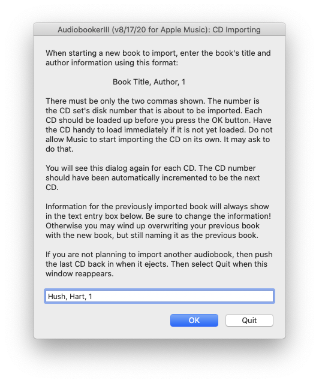
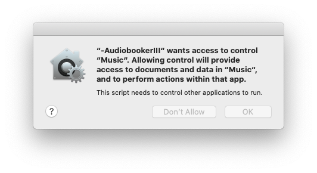

# AudiobookerIII/AudiobookerII

-   AudiobookerIII is an **Apple Music** utility that imports audiobook CDs for listening on an iPhone, iPad or iPod. AudiobookerII is the previous version before Apple changed **Apple iTunes** to **Apple Music**.

-   AudiobookerIII is a revision to work with **Apple Music**. AudiobookerII is a revision by AKS 3/29/2014, 10/31/2015, 01/26/2016 to the original Audiobooker by David Mundie 4/7/2003 that was posted by Doug Adams at Doug's AppleScripts for **Apple iTunes**.

-   The revisions were created out of necessity to consistently, without error, easily and correctly prepare many library audiobooks on a weekly basis for iPod and later iPhone listening. Beware, AudiobookerII's convenience and a public library with audiobooks available for checking out have worn out more than one optical drives using this utility!

### So exactly what does AudiobookerIII (AudibookerII) do?

-   With an Apple Mac computer with an optical drive you use AudiobookerIII (AudibookerII) to read, one by one, every CD of an audiobook that you may have checked out of your public library to create a playlist of that audiobook. The process makes that audiobook listenable as a proper **Apple Music** or **Apple iTunes** managed audiobook on an Apple computer, iPhone, iPad or iPod.
-   As an audiobook, the listening device keeps track of where you are in the audiobook.
-   The audiobook book "tracks" will be named in a sensible manner so you can also understand where you are in the audiobook as you listen. Audiobook CD track names that are directly imported using conventional means are typically useless.

### How To Install AudiobookerIII (AudibookerII)

AudiobookerIII (AudibookerII) is a "run only" Applescript "bundle" file that directs **Apple Music**, in the case of AudibookerIII, or that directs **Apple iTunes**, in the case of AudiobookerII, using an Applescript process. The respective Applescript files are named **~AudiobookerIII** and **~AudiobookerII**. Applescript files are add-in programs that can control Apple programs.

You actually do not have to "install" the AudiobookerIII or AudiobookerII Applescripts. They can run by themselves, but it makes sense to install them because they are used only in context with **Apple Music** or **Apple iTunes**. Once "installed" you will see them in the **Apple Music** and **Apple iTunes** user interfaces.

Installing the Applescript bundles involves placing the correct bundle file into the **Music** **Scripts** folder or the **iTunes** **Scripts** folder. These **Scripts** folders are in your **user** **Library** folder. That folder is normally hidden. An automatic installer has not been made, so you will need to closely follow these instructions.

#### Download: **[AudiobookerIII_II.zip](TheDownload/AudiobookerIII_II.zip)**

After downloading your system might have automatically extracted AudiobookerIII and AudiobookerII from the zip file's contents. The extracted results should be the application "bundle" files named **~AudiobookerIII** and **~AudiobookerII**. Double clicking the downloaded zip file usually extracts a zip file's contents. Extract the zip file's contents yourself if that did not happen automatically. On some older systems the Applescript files might appear as **~AudiobookerIII.app** and **~AudiobookerII.app**.

#### Follow these steps for installing AudiobookerIII (newer Mac OS X with Apple Music):

-   Quit the **Music** application if it happens to be running.
-   Locate your home **Library** folder. The **Library** folder is normally hidden on Macs. Select the **Go** at the **Finder** top menu. Do that again while also pressing the **option** key on your keyboard. _( **option** key is between **control** and **command** to the left of the keyboard spacebar.)_ You will see **Library** added to the list of places to go. Select **Library**. The **Finder** will open that **Library** folder.
-   In the library folder locate and open the **Music** folder.
-   Inside this **Music** folder, create a new folder named **Scripts** if one does not exist. There might already be a **Scripts** folder there. Older computers that were upgraded from previous Apple OS systems that did have iTunes could have a leftover **iTunes/Scripts** folder. That is not the folder you are looking for when installing for **Apple Music**.
-   Place the script file named **-AudiobookerIII** in the newly created Scripts folder. By the way, the tilde "~" character in the name **~AudiobookerIII** makes that script show up at the top of the available scripts list. 
-   Delete the **-AudiobookerII** file that was also extracted from the download. It is for **Apple iTunes**.
-   Launch **Music**. A **Music** Script menu  item displaying the script collection will now be available in the menu bar. You should see **~AudiobookerIII** in the  pulldown menu.

#### Follow these steps for installing AudiobookerII (Mac OS X with Apple iTunes):

-   Quit the **iTunes** application if it happens to be running.
-   Locate your home **Library** folder. The **Library** folder is hidden on newer Macs. Select the **Go** at the **Finder** top menu. Do that again while also pressing the **option** key on your keyboard. _( **option** key is between **control** and **command** to the left of the keyboard spacebar.)_ You will see **Library** added to the list of places to go. Select **Library**. The **Finder** will open that **Library** folder.
-   In the library folder locate and open the **iTunes** folder.
-   Inside this **iTunes** folder, create a new folder named **Scripts** if one does not exist. There might already be a **Scripts** folder there.
-   Place the script file named **~AudiobookerII** in the newly created Scripts folder. By the way, the tilde "~" character in the name **-AudiobookerII** makes that script show up at the top of the available scripts list. Delete the **-AudiobookerIII** file. It is for **Apple Music**.
-   Launch **iTunes**. An **iTunes** Script menu  item displaying the script collection will now be available in the menu bar. You should see **~AudiobookerII** in the  pulldown menu.

## Using AudiobookerIII (same for AudiobookerII)

#### Remember

-   Make sure to have the audiobook CDs readily available to load in the proper order starting from the first CD and ending with the last CD.
-   _**Follow AudiobookerIII's or AudiobookerII's instructions only.**_ Dismiss or Cancel any instructions from **iTunes** or the **Finder** that might also pop up. AudiobookerII's instructions all have something about them that allows you to know the instruction is from AudiobookerII.

-   On newer OS X systems you will see a one time grant permissions dialog. Grant the permission.

#### The Typical Use Flow

-   Have the CDs ready in order from first to last.
-   Start **Apple Music** or **Apple iTunes**.
-   Select **~AudiobookerIII (AudiobookerII)** from the Script menu .
-   The AudiobookerIII (AudiobookerII) CD Importing dialog should show.
-   Enter the book's title, the book's author and the number 1 in the entry field. Follow the entry format described in the AudiobookerIII (AudiobookerII) dialog. The number 1 is for the audiobook's CD number. You enter this audiobook information only once. The CD number is incremented for you every time you see this dialog when AudiobookerIII (AudiobookerII) is expecting the next CD to be loaded.
-   Press the **OK** button and immediately insert the number 1 CD into the optical drive.
-   AudiobookerII will be expecting **Apple Music** or **Apple iTunes** to see an audio CD being recognized by the computer. The computer has not yet informed **Apple Music** or **Apple iTunes** about the CD if you hear AudiobookerII asking for a CD even though you have just inserted it.
-   **Apple Music** or **Apple iTunes** will show all the CD's tracks and you will see the tracks renamed according to the Book,Author and CD number. **Apple Music** or **Apple iTunes** might also show a dialog asking to use information it obtained from the internet regarding the CD. _**Dismiss (Cancel) that dialog. It is not an AudiobookerIII or AudiobookerII instruction. The only importing dialog you should ever respond to is the Audiobooker CD Importing dialog.**_
-   **Apple Music** or **Apple iTunes** will import all the tracks. **Apple Music** or **Apple iTunes** ejects the CD when it is finished importing the tracks on that CD.
-   Remove the ejected CD and insert the next CD. You may hear, "Waiting for the next CD.", if you wait too long to insert the next CD.
-   AudiobookerIII or AudiobookerII will show again the CD Importing dialog, but this time the CD number in the text entry field will have been automatically updated for you. Refer to that number to tell you what CD number to insert when you realize you have forgotten where you are in the process.
-   Press the OK button.
-   Repeat this process for all the CDs, but after the last CD is ejected do this next step to end the process.
-   Reinsert the last CD. AudiobookerIII or AudiobookerII will show again. Press the **Quit** button in the CD Importing dialog. The CD will eject and AudiobookerII or AudiobookerII closes out.

#### Imported Audiobooks Are Playlists

-   AudiobookerII and AudiobookerII create a playlist for each imported audiobook CD set. The playlist names will start with the text "-ABk" so that they will be more distinguishable in the **Apple Music** or **Apple iTunes** playlist lists and so that they naturally group.

#### A Note For The Next Audiobook

-   **Make sure to update the Book,Author,CD number entry!** AudiobookerIII and AudiobookerII cannot read the CD to figure out the audiobook's name, author etc. The information you see in the entry field is for your last read audiobook. Forgetting to update the information will screwup your last imported audiobook.

#### The original Audiobooker's information:

Audiobooks have several characteristics that make ripping them different from ripping music CD's. For one thing, most audiobooks are not in CCDB, so that their metadata must be entered by hand. For another, they consist of multiple CD's where the order of the tracks is crucial, and where the track names should usually be generated automatically based on album name, CD number, and track number - it is pretty confusing to have all the first tracks in all the CD's of an audiobook be named "Track 1".

The Audiobooker script provides a convenient interface for ripping audiobooks. It shows the user the current book name, author name, and CD number, and allows that information to be corrected. For example, it might prompt for "War and Peace, Tolstoy, 1". It then imports multiple CD's, placing them all in a playlist named for the book, and numbering the tracks intelligently, using the first word of the title plus the CD and track number. In the example, it will create a playlist named "War and Peace", and name the tracks "WarandPeace-01-01", "WarWarandPeace-01-02", etc. This style of track name facilitates listening to the audiobook on an iPod.

As each CD is finished, the script waits for the user to insert another one before proceeding. The status of the script is stored in a file in the **iTunes** folder of the user's Application Support folder.

The script illustrates a number of useful techniques: using Unix "mkdir -p" for easy creation of directories (this is quite painful in Applescript itself); waiting for disk insertion; and detecting the Audio CD playlist

### Revisions to the original Audiobooker:

-   Reversed book information order to title,author.
-   Added space trimming function
-   Changed the base track names to be built from the book title compressed by removing spaces, removing the words 'The' and 'Of' instead of using the first word in the title.
-   Added **iTunes** track settings: Spoken Word equalizer, save location and skip shuffle.
-   Added information to the input dialog.
-   Changed playlist name to start with "-ABk " as an identifier.
-   Added some flow control.
-   Changes iTunes applicaiton references to Music application references.

### Note

-   This script must be exported as an Application (using Apple’s Applescript Editor) to avoid a benign timeout error that occurs right after the user input dialog.

-   AKSeidel 3/29/2014 , 10/31/2015, 01/26/2016, 08/17/2020
